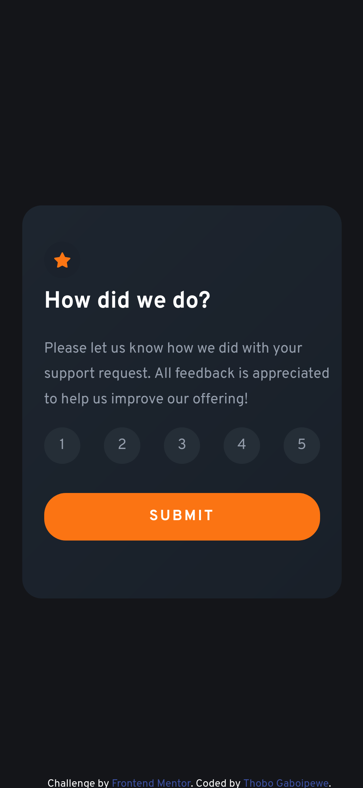

# Frontend Mentor - Interactive rating component solution

This is a solution to the [Interactive rating component challenge on Frontend Mentor](https://www.frontendmentor.io/challenges/interactive-rating-component-koxpeBUmI). Frontend Mentor challenges help you improve your coding skills by building realistic projects. 

## Table of contents

- [Overview](#overview)
  - [The challenge](#the-challenge)
  - [Screenshot](#screenshot)
  - [Links](#links)
- [My process](#my-process)
  - [Built with](#built-with)
  - [Useful resources](#useful-resources)
- [Author](#author)

## Overview

### The challenge

Users should be able to:

- View the optimal layout for the app depending on their device's screen size
- See hover states for all interactive elements on the page
- Select and submit a number rating
- See the "Thank you" card state after submitting a rating

### Screenshot

#### Desktop Rating State

#### Desktop Thank You State

#### Mobile Rating State

#### Mobile Thank You state

### Links

- Solution URL: [gaboipewe-t/interactive-rating-component-main](https://github.com/gaboipewe-t/interactive-rating-component-main)
- Live Site URL: [Frontend Mentor| Interactive Rating Component](https://interactive-rating-component-thobo.netlify.app/)

## My process

### Built with

- Semantic HTML5 markup
- Flexbox
- CSS Grid

### Useful resources

- [Mozilla Developer Network](https://www.developer.mozilla.com/us-en/docs)

## Author

- Frontend Mentor - [@gaboipewe-t](https://www.frontendmentor.io/profile/gaboipewe-t)
- Twitter - [@gaboipewe_thobo](https://www.twitter.com/gaboipewe_thobo)